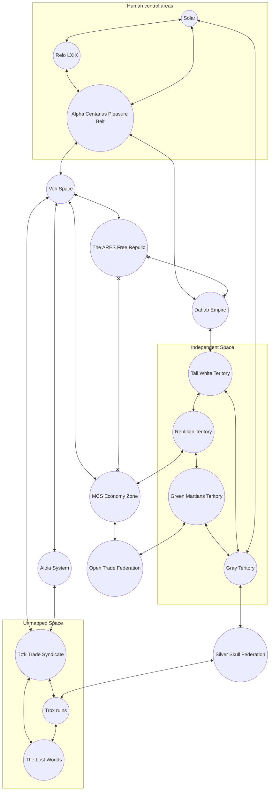

# Galaxy Map

```mermaid
flowchart TB;
	subgraph human[Human control areas]
		solar((Solar)) <--> relo((Relo LXIX))
		relo <--> alphac((Alpha Centarius Pleasure Belt))
		solar <--> alphac
	end
	
	subgraph inspace[Independent Space]
		J11((Gray Teritory)) <--> J12((Tall White Teritory))
		J12 <--> J13((Reptilian Teritory))
		J13 <--> J14((Green Martians Teritory))
		J14 <--> J11
	end
	
	subgraph US[Unmapped Space]
		tzk <--> TR((Trox ruins))
		tzk <--> tlw((The Lost Worlds))
		TR <--> tlw
	end		
	
	alphac <--> voh((Voh Space))	
	alphac <--> dahab((Dahab Empire))
	
	voh <--> mcs((MCS Economy Zone))
	voh <--> ares((The ARES Free Repulic))
	voh <--> aiola((Aiola System))
	voh <--> tzk((Tz'k Trade Syndicate))
	
	ares x--x mcs
	ares x--x dahab
	
	aiola <--> tzk
	
	J13 <--> mcs
	J14 <--> otf((Open Trade Federation))
	
	mcs <--> otf
	dahab <--> J12
	J11 <--> sskull((Silver Skull Federation))
	sskull <--> TR
	J11 <--> solar
```

---

Reference Links
* [[voh|Voh Space]]
* [[the_dahab_empire|Dahab Empire]]
* [[tzk_syndicate|Tz'k Syndicate]]
* 