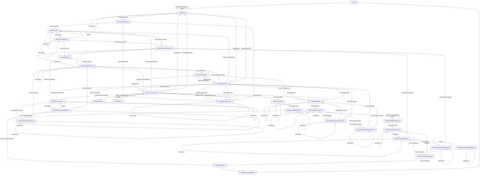

# Moratorium Onboarding - Journey Wiring Current Status

```mermaid
flowchart TD; 
 Index -- Create new Breathing Space --> ClientDetails;
 
 ClientDetails -- Save and continue --> ClientNamesSummary;
 ClientDetails -- OnPost Error --> ClientDetails; 

 ClientNamesSummary  -- Save and continue --> DebtorPostcode;
 ClientNamesSummary -- Add Previous Name --> ClientAddPreviousName;
 
 ClientAddPreviousName -- OnPost Error --> ClientAddPreviousName;
 ClientAddPreviousName --> ClientNamesSummary;

 DebtorPostcode -- OnPost Error --> DebtorPostcode; 
 DebtorPostcode -- Find address --> DebtorPostcodeResults;
 DebtorPostcode -- Enter address manually --> DebtorManualAddressSubmit;

 DebtorPostcodeResults -- Enter address manually --> DebtorManualAddressSubmit;
 DebtorPostcodeResults -- Change --> DebtorPostcode;
 DebtorPostcodeResults -- Save and continue --> DebtorAddresses;
 DebtorPostcodeResults -- OnPost Error --> DebtorPostcodeResults;

 DebtorManualAddressSubmit -- OnPost Error --> DebtorManualAddressSubmit;
 DebtorManualAddressSubmit --> DebtorAddresses;

 DebtorAddresses -- Save and continue --> DebtorContactPreference; 
 DebtorAddresses -- Add Previous Address --> DebtorPreviousAddress;
 
 DebtorPreviousAddress -- Find address --> DebtorPreviousAddressResults;
 DebtorPreviousAddress -- OnPost Error --> DebtorPreviousAddress;
 DebtorPreviousAddress -- Enter address manually --> DebtorPreviousAddressManual

 DebtorPreviousAddressResults -- Enter address manually --> DebtorPreviousAddressManual;
 DebtorPreviousAddressResults -- Change --> DebtorPreviousAddress;
 DebtorPreviousAddressResults -- Save and continue --> DebtorContactPreference;
 DebtorPreviousAddressResults -- OnPost Error --> DebtorPreviousAddressResults;

 DebtorPreviousAddressManual -- OnPost Error --> DebtorPreviousAddressManual;
 DebtorPreviousAddressManual -- Save and continue --> DebtorContactPreference;
 
 DebtorContactPreference -- Save and continue --> DebtorBusinessDetails;
 DebtorContactPreference -- OnPost Error --> DebtorContactPreference;

 DebtorBusinessDetails -- Save and continue No --> DebtorConfirmDetails;
 DebtorBusinessDetails -- Save and continue Yes --> DebtorAddBusiness;

 DebtorAddBusiness -- OnPost Error --> DebtorAddBusiness;
 DebtorAddBusiness -- Use current address --> DebtorConfirmDetails; 
 DebtorAddBusiness -- Another address --> DebtorAddBusinessAddress;

 DebtorAddBusinessAddress -- OnPost Error --> DebtorAddBusinessAddress; 
 DebtorAddBusinessAddress -- Find address --> DebtorAddBusinessAddressResults;
 DebtorAddBusinessAddress -- Enter address manually --> DebtorAddBusinessAddressManual;

 DebtorAddBusinessAddressResults -- Enter address manually --> DebtorAddBusinessAddressManual;
 DebtorAddBusinessAddressResults -- Change postcode --> DebtorAddBusinessAddress;
 DebtorAddBusinessAddressResults -- Change business name --> DebtorAddBusiness;
 DebtorAddBusinessAddressResults -- Save and continue --> DebtorConfirmDetails;
 DebtorAddBusinessAddressResults -- OnPost Error --> DebtorAddBusinessAddressResults;
 
 DebtorAddBusinessAddressManual -- OnPost Error --> DebtorAddBusinessAddressManual;
 DebtorAddBusinessAddressManual -- Save and continue --> DebtorConfirmDetails;
 DebtorAddBusinessAddressManual -- Change business name --> DebtorAddBusiness;

 DebtorConfirmDetails -- Save and continue --> DebtorAccountSummary;
 DebtorConfirmDetails -- Change business --> DebtorAddBusiness;
 DebtorConfirmDetails -- Add bussiness --> DebtorBusinessDetails;
 DebtorConfirmDetails -- Change contact preference --> DebtorContactPreference;
 DebtorConfirmDetails -- Change current address --> DebtorPostcode;
 DebtorConfirmDetails -- Hide current address --> DebtorHideAddress;
 DebtorConfirmDetails -- Change previous address --> DebtorPreviousAddress;
 DebtorConfirmDetails -- Change name --> ClientDetails;
 DebtorConfirmDetails -- Change date of birth --> ClientDetails;
 DebtorConfirmDetails -- Change previous name --> ClientAddPreviousName;
 DebtorConfirmDetails -- Add previous name --> ClientAddPreviousName;

 DebtorAccountSummary -- Change debt --> CreditorSearch;
 DebtorAccountSummary -- Add debt --> CreditorSearch;
 DebtorAccountSummary -- Change business --> DebtorAddBusiness;
 DebtorAccountSummary -- Add bussiness --> DebtorBusinessDetails;
 DebtorAccountSummary -- Change contact preference --> DebtorContactPreference;
 DebtorAccountSummary -- Change current address --> DebtorPostcode;
 DebtorAccountSummary -- Hide current address --> DebtorHideAddress;
 DebtorAccountSummary -- Change previous address --> DebtorPreviousAddress;
 DebtorAccountSummary -- Change name --> ClientDetails;
 DebtorAccountSummary -- Change date of birth --> ClientDetails;
 DebtorAccountSummary -- Change previous name --> ClientAddPreviousName;
 DebtorAccountSummary -- Add previous name --> ClientAddPreviousName;
 DebtorAccountSummary -- Save and continue --> DebtorAccountSave;

 CreditorSearch --> DebtorAccountSummary;

 DebtorAccountSave -- Save and continue --> DebtorBreathingSpaceType;
 DebtorAccountSave -- OnPost Error --> DebtorAccountSave;
 
 DebtorBreathingSpaceType -- Save and continue Normal --> DebtorDeclaration;
 DebtorBreathingSpaceType -- Save and continue Mental Health --> DebtorEligibilityConfirmation;
 DebtorBreathingSpaceType -- OnPost Error --> DebtorBreathingSpaceType;
 
 DebtorEligibilityConfirmation -- Save and continue --> DebtorAddNominatedContact;
 
 DebtorAddNominatedContact -- OnPost Error --> DebtorAddNominatedContact;
 DebtorAddNominatedContact -- Save and continue -->  DebtorPointContactSummary;
 DebtorAddNominatedContact -- Add Address --> DebtorPointContactAddress;
 
 DebtorPointContactAddress -- OnPost Error --> DebtorPointContactAddress; 
 DebtorPointContactAddress -- Find address --> DebtorPointContactAddressResults;
 DebtorPointContactAddress -- Enter address manually --> DebtorManualAddressSubmit;

 DebtorPointContactAddressResults -- Enter address manually --> DebtorManualAddressSubmit;
 DebtorPointContactAddressResults -- Change --> DebtorPointContactAddress;
 DebtorPointContactAddressResults -- Save and continue --> DebtorPointContactSummary;
 DebtorPointContactAddressResults -- OnPost Error --> DebtorPointContactAddressResults;

 DebtorPointContactAddressManual -- OnPost Error --> DebtorPointContactAddressManual;
 DebtorPointContactAddressManual --> DebtorPointContactSummary;
 
 DebtorPointContactSummary -- Save and continue --> DebtorDeclaration;
 DebtorPointContactSummary -- Change X --> DebtorAddNominatedContact;
 
 
 DebtorDeclaration --> DebtorAccountConfirmation;
 DebtorAccountConfirmation --x Index;
```
