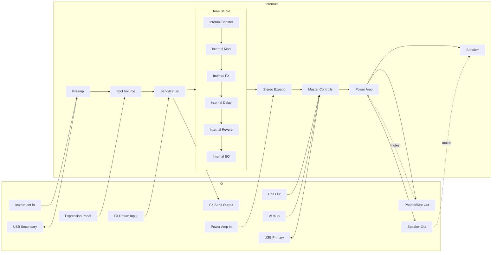

# Boss Katana Head MK2

#music/gear/amp

## Manual

![[999-🖼-files/manual-boss_katana_mk2.pdf]]

## Software

[FxFloorBoardKatana Forum Link](https://www.vguitarforums.com/smf/index.php?topic=20625.0)
[FxFloorBoardKatana Download Link](https://sourceforge.net/projects/fxfloorboard/files/KatanaFxFloorBoard/)

## Diagram

## Tips

- Turning on the stereo expand stops the cab sim on the Line out
