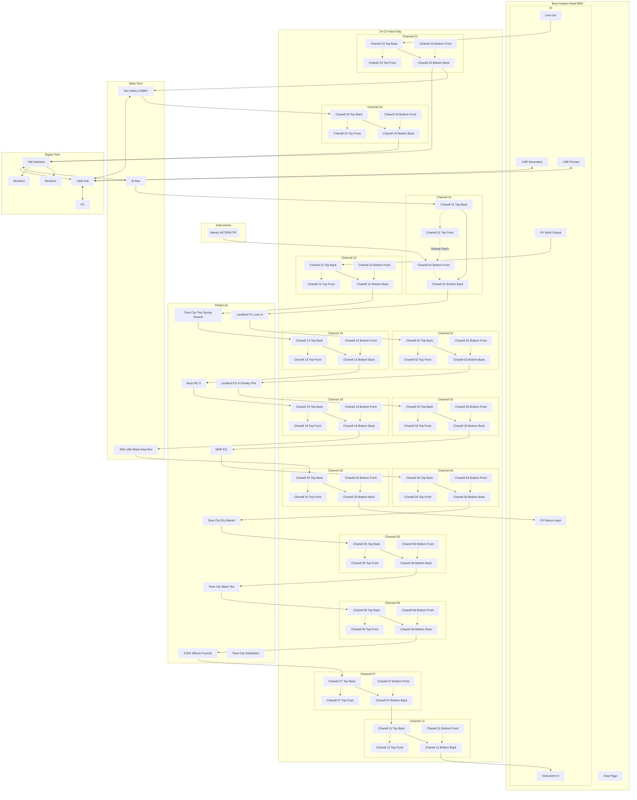

# Audio Setup

```mermaid
flowchart TD;
 	linkStyle default interpolate basis
	
	subgraph katana[Boss Katana Head MKII]
		katanaPage[Amp Page]
		
		subgraph katanaIO[IO]
			instrumentIn[Instrument In]
			%%expPedal[Expression Pedal]
			send[FX Send Output]
			return[FX Return Input]
			%%pwrampIn[Power Amp In]
			lineOut[Line Out]
			%%auxIn[AUX In]
			%%phonesOut[Phones/Rec Out]
			%%speakerOut[Speaker Out]
			usb2[USB Secondary]
			usb1[USB Primary]
		end
	end	
	
	subgraph patchbay[24 Ch Patch Bay]
		subgraph patchBayCh01 [Channel 01]
			ch01tb[Chanell 01 Top Back] --> ch01bb[Chanell 01 Bottom Back]
			ch01tb -.-> ch01tf[Chanell 01 Top Front]
			ch01bf[Chanell 01 Bottom Front] -.-> ch01bb			
		end 
        subgraph patchBayCh02 [Channel 02]
			ch02tb[Chanell 02 Top Back] --> ch02bb[Chanell 02 Bottom Back]
			ch02tb -.-> ch02tf[Chanell 02 Top Front]
			ch02bf[Chanell 02 Bottom Front] -.-> ch02bb			
		end 
        subgraph patchBayCh03 [Channel 03]
			ch03tb[Chanell 03 Top Back] --> ch03bb[Chanell 03 Bottom Back]
			ch03tb -.-> ch03tf[Chanell 03 Top Front]
			ch03bf[Chanell 03 Bottom Front] -.-> ch03bb			
		end 
        subgraph patchBayCh04 [Channel 04]
			ch04tb[Chanell 04 Top Back] --> ch04bb[Chanell 04 Bottom Back]
			ch04tb -.-> ch04tf[Chanell 04 Top Front]
			ch04bf[Chanell 04 Bottom Front] -.-> ch04bb			
		end 
        subgraph patchBayCh05 [Channel 05]
			ch05tb[Chanell 05 Top Back] --> ch05bb[Chanell 05 Bottom Back]
			ch05tb -.-> ch05tf[Chanell 05 Top Front]
			ch05bf[Chanell 05 Bottom Front] -.-> ch05bb			
		end 
        subgraph patchBayCh06 [Channel 06]
			ch06tb[Chanell 06 Top Back] --> ch06bb[Chanell 06 Bottom Back]
			ch06tb -.-> ch06tf[Chanell 06 Top Front]
			ch06bf[Chanell 06 Bottom Front] -.-> ch06bb			
		end 
        subgraph patchBayCh07 [Channel 07]
			ch07tb[Chanell 07 Top Back] --> ch07bb[Chanell 07 Bottom Back]
			ch07tb -.-> ch07tf[Chanell 07 Top Front]
			ch07bf[Chanell 07 Bottom Front] -.-> ch07bb			
		end 
        %%subgraph patchBayCh08 [Channel 08]
		%%	ch08tb[Chanell 08 Top Back] --> ch08bb[Chanell 08 Bottom Back]
		%%	ch08tb -.-> ch08tf[Chanell 08 Top Front]
		%%	ch08bf[Chanell 08 Bottom Front] -.-> ch08bb			
		%%end 
        %%subgraph patchBayCh09 [Channel 09]
		%%	ch09tb[Chanell 09 Top Back] --> ch09bb[Chanell 09 Bottom Back]
		%%	ch09tb -.-> ch09tf[Chanell 09 Top Front]
		%%	ch09bf[Chanell 09 Bottom Front] -.-> ch09bb			
		%%end 
        %%subgraph patchBayCh10 [Channel 10]
		%%	ch10tb[Chanell 10 Top Back] --> ch10bb[Chanell 10 Bottom Back]
		%%	ch10tb -.-> ch10tf[Chanell 10 Top Front]
		%%	ch10bf[Chanell 10 Bottom Front] -.-> ch10bb			
		%%end 
        subgraph patchBayCh11 [Channel 11]
			ch11tb[Chanell 11 Top Back] --> ch11bb[Chanell 11 Bottom Back]
			ch11tb -.-> ch11tf[Chanell 11 Top Front]
			ch11bf[Chanell 11 Bottom Front] -.-> ch11bb			
		end 
        subgraph patchBayCh12 [Channel 12]
			ch12tb[Chanell 12 Top Back] --> ch12bb[Chanell 12 Bottom Back]
			ch12tb -.-> ch12tf[Chanell 12 Top Front]
			ch12bf[Chanell 12 Bottom Front] -.-> ch12bb			
		end 
        subgraph patchBayCh13 [Channel 13]
			ch13tb[Chanell 13 Top Back] --> ch13bb[Chanell 13 Bottom Back]
			ch13tb -.-> ch13tf[Chanell 13 Top Front]
			ch13bf[Chanell 13 Bottom Front] -.-> ch13bb			
		end 
        %%subgraph patchBayCh14 [Channel 14]
		%%	ch14tb[Chanell 14 Top Back] --> ch14bb[Chanell 14 Bottom Back]
		%%	ch14tb -.-> ch14tf[Chanell 14 Top Front]
		%%	ch14bf[Chanell 14 Bottom Front] -.-> ch14bb			
		%%end 
        %%subgraph patchBayCh15 [Channel 15]
		%%	ch15tb[Chanell 15 Top Back] --> ch15bb[Chanell 15 Bottom Back]
		%%	ch15tb -.-> ch15tf[Chanell 15 Top Front]
		%%	ch15bf[Chanell 15 Bottom Front] -.-> ch15bb			
		%%end 
        %%subgraph patchBayCh16 [Channel 16]
		%%	ch16tb[Chanell 16 Top Back] --> ch16bb[Chanell 16 Bottom Back]
		%%	ch16tb -.-> ch16tf[Chanell 16 Top Front]
		%%	ch16bf[Chanell 16 Bottom Front] -.-> ch16bb			
		%%end 
        %%subgraph patchBayCh17 [Channel 17]
		%%	ch17tb[Chanell 17 Top Back] --> ch17bb[Chanell 17 Bottom Back]
		%%	ch17tb -.-> ch17tf[Chanell 17 Top Front]
		%%	ch17bf[Chanell 17 Bottom Front] -.-> ch17bb			
		%%end 
        %%subgraph patchBayCh18 [Channel 18]
		%%	ch18tb[Chanell 18 Top Back] --> ch18bb[Chanell 18 Bottom Back]
		%%	ch18tb -.-> ch18tf[Chanell 18 Top Front]
		%%	ch18bf[Chanell 18 Bottom Front] -.-> ch18bb			
		%%end 
        subgraph patchBayCh19 [Channel 19]
			ch19tb[Chanell 19 Top Back] --> ch19bb[Chanell 19 Bottom Back]
			ch19tb -.-> ch19tf[Chanell 19 Top Front]
			ch19bf[Chanell 19 Bottom Front] -.-> ch19bb			
		end 
        subgraph patchBayCh20 [Channel 20]
			ch20tb[Chanell 20 Top Back] --> ch20bb[Chanell 20 Bottom Back]
			ch20tb -.-> ch20tf[Chanell 20 Top Front]
			ch20bf[Chanell 20 Bottom Front] -.-> ch20bb			
		end 
        %%subgraph patchBayCh21 [Channel 21]
		%%	ch21tb[Chanell 21 Top Back] --> ch21bb[Chanell 21 Bottom Back]
		%%	ch21tb -.-> ch21tf[Chanell 21 Top Front]
		%%	ch21bf[Chanell 21 Bottom Front] -.-> ch21bb			
		%%end 
        %%subgraph patchBayCh22 [Channel 22]
		%%	ch22tb[Chanell 22 Top Back] --> ch22bb[Chanell 22 Bottom Back]
		%%	ch22tb -.-> ch22tf[Chanell 22 Top Front]
		%%	ch22bf[Chanell 22 Bottom Front] -.-> ch22bb			
		%%end 
        subgraph patchBayCh23 [Channel 23]
			ch23tb[Chanell 23 Top Back] --> ch23bb[Chanell 23 Bottom Back]
			ch23tb -.-> ch23tf[Chanell 23 Top Front]
			ch23bf[Chanell 23 Bottom Front] -.-> ch23bb			
		end 
        subgraph patchBayCh24 [Channel 24]
			ch24tb[Chanell 24 Top Back] --> ch24bb[Chanell 24 Bottom Back]
			ch24tb -.-> ch24tf[Chanell 24 Top Front]
			ch24bf[Chanell 24 Bottom Front] -.-> ch24bb			
		end 
	end
		
	subgraph instruments[Instruments]
		as73fm-tif(Ibanez AS73FM-TIF) --> ch01bf
	end
	
	subgraph pedals[Pedal List]
		tunner[Landlord FX Lock In] --> ch02tb
		compressor[Landlord FX A Cheeky Pint] --> ch03tb 
		eq[MXR EQ] --> ch04tb 
		martiniDrive[Tone City Dry Martini] --> ch05tb 		
		teaDrive[Tone City Black Tea] --> ch06tb 		
		fuzz[ZVEX Effects Fuzzolo] --> ch07tb
		reverb[Tone City Tiny Spring Reverb] --> ch13tb 
		looper[Boss RC-5] --> ch19tb 		
					
		psu[Tone City Substation]
				
		ch01bb --> tunner
		ch02bb --> compressor
		ch03bb --> eq
		ch04bb --> martiniDrive
		ch05bb --> teaDrive
		ch06bb --> fuzz
		ch07bb --> ch11tb
		ch11bb --> instrumentIn
		ch12bb --> reverb
		ch13bb --> looper
	end
	
	subgraph metaTech[Meta Tech]
		reampBox[DI Box] --> ch01tb
		ch01tf -.->|Reamp Patch|ch01bf 
		cabm[Two Notes CABM+] --> ch24tb	
		ch23bb --> cabm
		
		volumePot[JHS Little Black Amp Box] --> ch20tb	
		ch19bb --> volumePot			
	end
	
	subgraph it[Digital Tech]
		ch24bb --> volt[Volt Interface]
		volt --> monitor1[Monitor1]
		volt --> monitor2[Monitor2]
		volt --> reampBox
		usb1 <--> hub[USB Hub]
		usb2 <--> hub
		cabm <--> hub
		volt <--> hub
		hub <--> pc[PC]
	end
	
	send --> ch12tb		
	lineOut --> ch23tb
	ch20bb --> return
	ch23bb --> volt
	
	classDef default stroke:#fff
	class katanaPage internal-link;
	click katanaPage "/katana_head";
```
