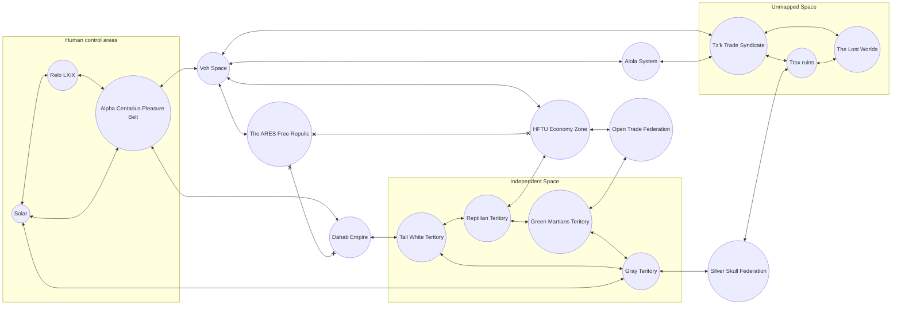

# Galaxy Map

```mermaid
graph LR;
	subgraph human[Human control areas]
		solar((Solar)) <--> relo((Relo LXIX))
		relo <--> alphac((Alpha Centarius Pleasure Belt))
		solar <--> alphac		
	end
	
	subgraph inspace[Independent Space]
		J11((Gray Teritory)) <--> J12((Tall White Teritory))
		J12 <--> J13((Reptilian Teritory))
		J13 <--> J14((Green Martians Teritory))
		J14 <--> J11
	end
	
	subgraph US[Unmapped Space]
		tzk <--> TR((Trox ruins))
		tzk <--> tlw((The Lost Worlds))
		TR <--> tlw
	end		
	
	alphac <--> voh((Voh Space))	
	alphac <--> dahab((Dahab Empire))
	
	voh <--> hftu((HFTU Economy Zone))
	voh <--> ares((The ARES Free Repulic))
	voh <--> aiola((Aiola System))
	voh <--> tzk((Tz'k Trade Syndicate))
	
	ares x--x hftu
	ares x--x dahab
	
	aiola <--> tzk
	
	J13 <--> hftu
	J14 <--> otf((Open Trade Federation))
	
	hftu <--> otf
	dahab <--> J12
	J11 <--> sskull((Silver Skull Federation))
	sskull <--> TR
	J11 <--> solar	
	

class solar internal-link;
class voh internal-link;
class dahab internal-link;
class tzk internal-link;
class aiola internal-link;
class J14 internal-link;
class ares internal-link;
class hftu internal-link;

click solar "/solar_sector";
click voh "/voh";
click dahab "/the_dahab_empire";
click tzk "/tzk_syndicate";
click aiola "/aiola_system";
click J14 "/green_man";
click ares "/ares";
click hftu "/the_high_frequency_traders_union";
```
